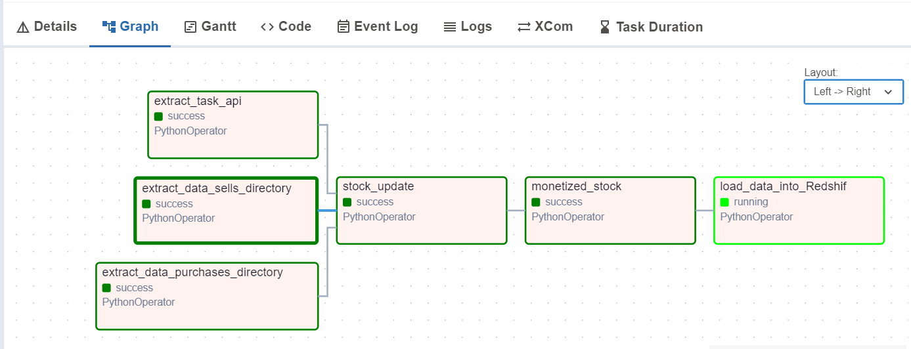
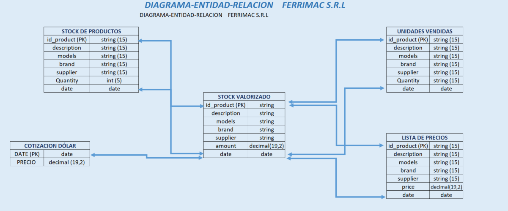

# :rocket: Proyecto ETL - Ferrimac :hammer: :wrench:

## :memo: Descripción del Proyecto

Este proyecto ETL (Extract, Transform, Load) está diseñado para Ferrimac, una ferretería que necesita optimizar la gestión de su stock. Utiliza Apache Airflow para automatizar el proceso de extracción, transformación y carga de datos desde una API y archivos locales. El objetivo principal es calcular y visualizar el stock valorizado en pesos, tomando en cuenta los productos en inventario, su precio en dólares y la cotización diaria del dólar.

El pipeline incluye múltiples tareas (tasks) en Airflow, responsables de extraer la información de ventas y compras, actualizar el stock y cargar los datos transformados en una base de datos Amazon Redshift.


## :file_folder: Estructura del Proyecto.


```bash

ETL_AIRFLOW
    ├── /.github/workflows                             #
    ├── /base_datos/                                   # Base de datos donde se almacenan archivos del negocio.
    ├── /config/                                       # Configuración de Airflow.
    ├── /dags/
    │     ├── etl_update_stock_ferrimac.py             # Archivo principal del DAG de Airflow.
    ├── /logs/                                         # Carpeta donde persisten los logs de Airflow.
    ├── /functions_etl/
    │     ├── data_transform.py                        # Archivo que transforma los datos y valoriza el stock.
    │     ├── extract_file_purchases_to_stock.py       # Función que extrae datos del sistema de compras.
    │     ├── extract_file_sells_to_stock.py           # Función que extrae datos del sistema de ventas.
    │     ├── load_data.py                             # Función que carga los datos en Redshift.
    │     ├── obtain_currency.py                       # Función que obtiene la cotización del dólar.
    │     ├── update_stock.py                          # Función que actualiza el stock en unidades.
    ├── /plugins/                                      # Directorio de configuración de Airflow.
    ├── /test/                                         # Directorio con pruebas unitarias.
    ├── /utils/
    │     ├── config.py                                # Archivo de configuración de variables de entorno.
    ├── .gitignore                                     # Archivo de configuración de Git.
    ├── docker-compose.yml                             # Archivo de configuración de Docker Compose.
    ├── README.md                                      # Documentación del proyecto.
    └── requirements.txt                               # Archivo con librerías utilizadas en el proyecto.                                   
    
```


## :desktop_computer: :gear: Pasos de Configuración.

## :memo: Pre requisitos.

:white_check_mark: *Python 3.8 o superior* 🐍


:white_check_mark: *Apache Airflow* 🌬️


:white_check_mark: *Docker y Docker Compose* 🐳

## Pasos

1- Clonar el repositorio.

```bash
# Comando para clonar el repositorio
git clone git@github.com:Simontiberio/ETL_airflow.git

```

2- Crear un archivo .env en el directorio principal del proyecto, incluyendo las credenciales de la API y las rutas de los archivos de ventas y compras.


```bash

# Credenciales Redshift.
REDSHIFT_USER= '2024_nombre_apellido'
REDSHIFT_PASSWORD='PASSWORD'
REDSHIFT_DB= 'NOMBRE_DB'
REDSHIFT_HOST='REDSHIFT_HOST'
REDSHIFT_PORT= PORT

# Variables de entorno.
REDSHIFT_SCHEMA = 'REDSHIFT_SCHEMA'
api_key = 'your_api_key'
compras_file = 'nombre_archivo.xlsx'
stock_file = 'nombre_archivo.xlsx'
ventas_file = 'nombre_archivo.xlsx'
monetized_stock_file = 'nombre_archivo.xlsx'
data_quotes = 'nombre_archivo.csv'
list_prices_file = 'nombre_archivo.xlsx'

```
3- Iniciar los servicios de Airflow utilizando Docker Compose:

```bash
docker-compose --env-file .env up -d
```

4- Acceder a la interfaz de Airflow en http://localhost:8080 y activar el DAG llamado etl_update_stock_ferrimac.


5- Credenciales de acceso

Usuario: airflow

Contraseña: airflow

Nota: Asegúrate de que estas credenciales coincidan con las configuradas en tu archivo docker-compose.yml, si las has cambiado.

6- Activar el DAG

Después de iniciar sesión, activa el DAG llamado etl_update_stock_ferrimac para comenzar el proceso de ETL. Puedes encontrarlo en la lista de DAGs en la interfaz principal.


## Estructura del Pipeline.

El pipeline de Airflow se compone de tres fases principales:

:one: Extracción de Datos

En esta etapa, se recolectan los datos mediante tres tareas ejecutadas en paralelo:

``` append_to_data_price :``` Obtiene diariamente la cotización del dólar desde una API, actualizando un archivo histórico de cotizaciones.

``` extract_file_sells_to_stock : ``` Extrae las ventas diarias del sistema de ventas al cierre de cada jornada.

``` extract_file_purchases_to_stock :``` Recupera las compras de productos a distintos proveedores, actualizando el inventario con las compras recepcionadas.

:two: Transformación de Datos

Aquí se transforman los datos para calcular el valor del stock.

``` update_stock : ```: Actualiza el stock diario considerando las ventas y compras registradas.

``` monetize_stock :``` Valoriza el stock actualizado utilizando la última lista de precios en dólares y la cotización del día.

:three: Carga de Datos

En esta última etapa, los datos son almacenados y cargados en Redshift.

``` load_data :``` Convierte el stock valorizado a formato Parquet para un almacenamiento más eficiente.

``` load_data_to_Redshift :``` Carga el archivo Parquet a la base de datos Redshift, ubicada en un cluster de AWS.


## Representacion gráfica del DAG y sus dependencias entre tareas.

A continuación, se visualiza las secuencias y dependencias de las tareas que componen el DAG. 

:warning: El DAG se encuentra programado para que inicie a las 10 p.m de Lunes a Sabados, entendiendo que para esa hora ya culmino la jornada laboral (``` schedule_interval='0 22 * * 1-6'```).





## Diagrama Entidad Relación de Ferrimac

A continuacion, se muestra como se modelo el subdomionio de mercaderias: 





## 🗂️ Descripción del Modelo de Datos. 📝 

Este modelo de datos soporta la valorización y gestión de inventarios mediante el almacenamiento de información clave sobre productos, proveedores y registros diarios de actividades (ventas, compras y valorización de stock). La estructura de las tablas facilita un análisis detallado y diario de cada aspecto de la gestión de inventarios.

Columnas de Producto y Proveedor:

Las primeras cinco columnas (id_product, model, descripcion, suppliers, y brands) contienen información descriptiva y de identificación del producto, así como detalles del proveedor y marca.

Campos de Fecha (date):

Cada columna con un formato de fecha (por ejemplo, 2024-19-09) representa un snapshot diario de las operaciones, manteniendo un registro detallado de las actividades de cada día del mes.
Granularidad: Estas columnas de fecha representan valores diarios, con un snapshot diario de cada variable (como stock, unidades vendidas y compras). Esto permite analizar las variaciones diarias del inventario y calcular el valor del stock en función de los movimientos de venta y compra, y la cotización diaria del dólar.
Propósito de las fechas: Al incluir una columna por cada día del mes, es posible observar el comportamiento y cambios en el stock en un intervalo de tiempo específico, facilitando tanto la consulta histórica como el análisis de tendencias y la valorización precisa.


### ⚙️ Pruebas Unitarias

Este proyecto cuenta con un conjunto de pruebas unitarias implementadas con la biblioteca `pytest`. Estas pruebas permiten verificar el correcto funcionamiento de funciones clave, asegurando que los datos se carguen y transformen adecuadamente y que la conexión con la API se realice de forma correcta. Ejecutar las pruebas de manera regular ayuda a detectar posibles errores o cambios en el comportamiento esperado, mejorando así la calidad y la confiabilidad del código.

#### 🔍 Funcionalidad de las Pruebas Actuales

1. **📄 Prueba de carga de datos** (`test_load_data_file`): Valida si el archivo se carga correctamente en formato Excel, convirtiéndolo en un archivo parquet con la estructura y ubicación esperada.
2. **💱 Prueba de obtención de cotizacion del dolar** (`test_obtain_currency`): Comprueba si se obtiene el diccionario con los datos correctos desde una API externa, validando la respuesta y estructura esperada.

#### 📋 Requisitos Previos

Para ejecutar las pruebas unitarias, asegurarse de que `pytest` esté instalado. Si no lo tienes, puedes instalarlo con:

```bash
pip install pytest
```

### 🚀 Instrucciones para Ejecutar las Pruebas

 1- Dirígete al directorio raíz del proyecto:

```bash
cd etl_airflow/test/
```

 2- Ejecuta todas las pruebas unitarias usando el comando:

```bash
pytest test_load_data_file.py
```

```bash
pytest obtain_currency.py
```

3- Si deseas ver detalles de cada prueba (modo detallado), ejecuta:

```bash
pytest -v test_load_data_file.py
```


## 🛠️ Áreas de Mejora  🔧 

Para continuar evolucionando y mejorando el pipeline de datos desarrollado para Ferrimac, se identifican las siguientes oportunidades de mejora, que pueden brindar un valor agregado y permitir una gestión más eficiente de las operaciones del negocio:

:one: Modelos Predictivos para anticiparse al comportamiento de las variables del negocio: 
La implementación de modelos de machine learning que permitan predecir la volatilidad del tipo de cambio beneficiaría la toma de decisiones financieras y de compra de inventario. Con estas proyecciones, Ferrimac podría optimizar sus compras y reducir riesgos asociados a fluctuaciones en la divisa, mejorando la precisión en la valorización de su stock y en la planificación de costos.  Lo mismo aplica para las predicciones de los picos de demanda. Esto permitiría a Ferrimac planificar inventarios y asegurar disponibilidad de productos en momentos clave, optimizando la cadena de suministro y reduciendo costos de oportunidad asociados a la falta de stock.


:two: Desarrollo de interfaces gráficas para la visualización de datos : 
Incorporar interfaces gráficas permitiría a Ferrimac visualizar de manera intuitiva y en tiempo real la información clave sobre las variaciones del tipo de cambio y la valorización del stock. Estas visualizaciones facilitarían la identificación de tendencias y patrones de forma rápida y accesible, permitiendo al equipo tomar decisiones informadas y en tiempo adecuado. Además, una representación visual de los datos aumentaría la transparencia y comprensión de la evolución del negocio, mejorando la comunicación y el análisis estratégico.

Estas áreas de mejora proporcionarían una visión integral de los datos, convirtiéndolos en un activo estratégico que no solo gestione el presente, sino que también permita a Ferrimac prepararse para el futuro, anticipando riesgos y capitalizando oportunidades de manera más eficiente.