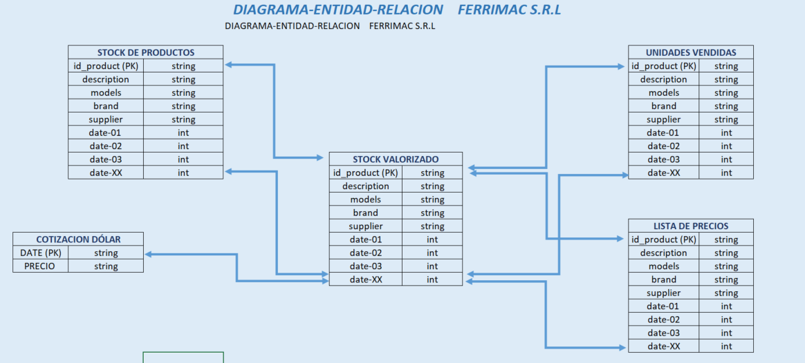

# :rocket: Proyecto ETL - Ferrimac :hammer: :wrench:

## :memo: Descripción del Proyecto

Este proyecto ETL (Extract, Transform, Load) está diseñado para Ferrimac, una ferretería que necesita optimizar la gestión de su stock. Utiliza Apache Airflow para automatizar el proceso de extracción, transformación y carga de datos desde una API y archivos locales. El objetivo principal es calcular y visualizar el stock valorizado en pesos, tomando en cuenta los productos en inventario, su precio en dólares y la cotización diaria del dólar.

El pipeline incluye múltiples tareas (tasks) en Airflow, responsables de extraer la información de ventas y compras, actualizar el stock y cargar los datos transformados en una base de datos Amazon Redshift.


## Estructura del Proyecto 


```bash

ETL_AIRFLOW
    ├── /base_datos/                                   # Base de datos donde se almacenan archivos del negocio.
    ├── /config/                                       # Configuración de Airflow.
    ├── /dags/
    │     ├── etl_update_stock_ferrimac.py             # Archivo principal del DAG de Airflow.
    ├── /logs/                                         # Carpeta donde persisten los logs de Airflow.
    ├── /functions_etl/
    │     ├── data_transform.py                        # Archivo que transforma los datos y valoriza el stock.
    │     ├── extract_file_purchases_to_stock.py       # Función que extrae datos del sistema de compras.
    │     ├── extract_file_sells_to_stock.py           # Función que extrae datos del sistema de ventas.
    │     ├── load_data.py                             # Función que carga los datos en Redshift.
    │     ├── obtain_currency.py                       # Función que obtiene la cotización del dólar.
    │     ├── update_stock.py                          # Función que actualiza el stock en unidades.
    ├── /plugins/                                      # Directorio de configuración de Airflow.
    ├── /test/                                         # Directorio con pruebas unitarias.
    ├── /utils/
    │     ├── config.py                                # Archivo de configuración de variables de entorno.
    ├── .env                                           # Archivo de configuración y definición de variables de entorno.
    ├── .gitignore                                     # Archivo de configuración de Git.
    ├── docker-compose.yml                             # Archivo de configuración de Docker Compose.
    ├── README.md                                      # Documentación del proyecto.
    └── requirements.txt                               # Archivo con librerías utilizadas en el proyecto.
```


## :desktop_computer: :gear: Pasos de Configuración.

## :memo: Pre requisitos.

:white_check_mark: *Python 3.8 o superior* 🐍


:white_check_mark: *Apache Airflow* 🌬️


:white_check_mark: *Docker y Docker Compose* 🐳

## Pasos

1- Clonar el repositorio.

```bash
# Comando para clonar el repositorio
git clone git@github.com:Simontiberio/ETL_airflow.git

```

2- Crear un archivo .env con las configuraciones necesarias, incluyendo las credenciales de la API y las rutas de los archivos de ventas y compras.


```bash
# UID AIRFLOW.
AIRFLOW_UID=1000

# Credenciales Redshift.
REDSHIFT_USER= '2024_nombre_apellido'
REDSHIFT_PASSWORD='PASSWORD'
REDSHIFT_DB= 'NOMBRE_DB'
REDSHIFT_HOST='REDSHIFT_HOST'
REDSHIFT_PORT= PORT

# Variables de entorno.
REDSHIFT_SCHEMA = 'REDSHIFT_SCHEMA'
api_key = 'your_api_key'
compras_file = 'nombre_archivo.xlsx'
stock_file = 'nombre_archivo.xlsx'
ventas_file = 'nombre_archivo.xlsx'
monetized_stock_file = 'nombre_archivo.xlsx'
data_quotes = 'nombre_archivo.csv'
list_prices_file = 'nombre_archivo.xlsx'

```
3- Iniciar los servicios de Airflow utilizando Docker Compose:

```bash
docker-compose up -d
```

4- Acceder a la interfaz de Airflow en http://localhost:8080 y activar el DAG llamado etl_update_stock_ferrimac.


## Estructura del Pipeline 

El pipeline de Airflow se compone de tres fases principales:

:one: Extracción de Datos

En esta etapa, se recolectan los datos mediante tres tareas ejecutadas en paralelo:

``` def append_to_data_price():```: Obtiene diariamente la cotización del dólar desde una API, actualizando un archivo histórico de cotizaciones.

``` def extract_file_sells_to_stock (): ``` Extrae las ventas diarias del sistema de ventas al cierre de cada jornada.

``` def extract_file_purchases_to_stock ():``` Recupera las compras de productos a distintos proveedores, actualizando el inventario con las compras recepcionadas.

:two: Transformación de Datos

Aquí se transforman los datos para calcular el valor del stock.

``` def update_stock (): ```: Actualiza el stock diario considerando las ventas y compras registradas.

``` def monetize_stock ():``` Valoriza el stock actualizado utilizando la última lista de precios en dólares y la cotización del día.

:three: Carga de Datos

En esta última etapa, los datos son almacenados y cargados en Redshift.

``` def load_data ():``` Convierte el stock valorizado a formato Parquet para un almacenamiento más eficiente.

``` def load_data_to_Redshift ():``` Carga el archivo Parquet a la base de datos Redshift, ubicada en un cluster de AWS.


## Representacion grafica del DAG y sus dependencias entre tareas.


## Diagrama Entidad Relacion de Ferrimac

A continuacion, se muestra como se modelo el subdomionio de mercaderias: 

